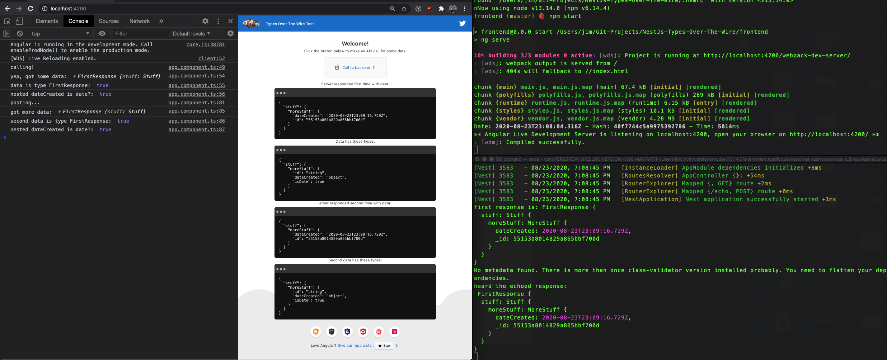

# NestJs-Types-Over-The-Wire
A clean way to send Dates, ObjectIds, and other types between front and back-end. 

<br/>

### Problem We're Trying To Solve Here
Even though we're using Typescript, HTTP responses received with properties whose types are things like `Date` or `ObjectId` (from mongo) come through as strings. We wanted an elegant way to have the correct types on both sides.

In addition, it would be nice if we could refer to `_id` on the backend (since it's a mongo thing) and haev it be automatically transformed into `id` for the friend-end side of things.

<br/>

### Solution Here
This solution does a few key things to elegantly convert objects to those with the correct types.

<br/>

#### On the front-end:

- The incoming string that needs to be converted to a date is handled by defining with "@Type" decorators on classes where the Date type is specified in the decorator argument. [example](https://github.com/JimLynchCodes/NestJs-Types-Over-The-Wire/blob/master/frontend/src/app/response.models.ts#L18)

- Responses of HTTP requests are transformed to the proper types using class-transformer's "plainToClass" function. [example](https://github.com/JimLynchCodes/NestJs-Types-Over-The-Wire/blob/master/frontend/src/app/app.component.ts#L52)

- Outgoing payloads are converted from class to plain using class-transformer's "classtoPlain" function (or else you'll likely get JSON parse errors). [example](https://github.com/JimLynchCodes/NestJs-Types-Over-The-Wire/blob/master/frontend/src/app/app.component.ts#L82)


<br/>

#### On the back-end:

- [Registers global interceptors with interceptors](https://github.com/JimLynchCodes/NestJs-Types-Over-The-Wire/blob/master/backend/src/main.ts#L12) with the ["unserscore id to id interceptor"](https://github.com/JimLynchCodes/NestJs-Types-Over-The-Wire/blob/master/backend/src/underscore-id-to-id-interceptor.ts) to automatically change classes to plain in the outgoing response after you have [returned a class in the controller](https://github.com/JimLynchCodes/NestJs-Types-Over-The-Wire/blob/master/backend/src/app.controller.ts#L10).

- [Registers global pipes to use the ValidationPipe with transform: true](https://github.com/JimLynchCodes/NestJs-Types-Over-The-Wire/blob/master/backend/src/main.ts#L14) in order to automatically transform incoming requests from "plain" to "class" so that, for example, your [post bodies in controllers come in as the nice types you are expecting](https://github.com/JimLynchCodes/NestJs-Types-Over-The-Wire/blob/master/backend/src/app.controller.ts#L15).

- Defines DTOs as classes decorated with [@Type for incoming strings that need to be converted to Date](https://github.com/JimLynchCodes/NestJs-Types-Over-The-Wire/blob/master/backend/src/response.models.ts#L12), the custom [@TransformObjectId decorator for converting incoming strings to ObjectIds](https://github.com/JimLynchCodes/NestJs-Types-Over-The-Wire/blob/master/backend/src/response.models.ts#L9) (props to Steve for this!), and the @Expose decorator to rename plain "id" property to "_id" for the class, and the reverse- the class "_id" proeprty "id" in the plain.

<br/>

### Screenshot



<br/>
<br/>

## Usage

made with node v13.14.0

First install [nvm](https://github.com/nvm-sh/nvm), then run this in the root folder:
```
nvm use
```

The ___backend___ directory contains a NestJS project.

Start the backend server locally at `http:localhost:3000` by running this in the `backend` directory:
```
npm start
```


The ___frontend___ folder contains an Angular project.

Start the frontend server locally at `http:localhost:4200` by running this in the `frontend` directory:
```
npm start
```

<br/>

<br/>

Now, go to `http:localhost:4200` and click the button on the page.

Notice the response that's displayed on the page and that "isDate" is true. This means that our angular code is seeing it as a "Date" type everywhere in our code because we the "@Type" decorator is used to transform the string to a Date immediately when it comes back (in the map).

Notice how if we remove any of the @Type decorators in the `response.models` file then is shows "createdDate" as a string and not a date.

If we use the Decorators here then we immediately get a response with the types we want by doing this fancy mappage:
```
pipe(map(res => plainToClass(FirstResponse, res as Object)))
```

In the above code the "pipe(map(" is a somewhat ugly rxjs syntax for mapping over the response(s). 

The key thing to recognize is that the objects come as an object literal with string keys and string values, a "plain" as they say in the class-transformer library docs and api.

So, the "plainToClass" function takes a plain and returns a class instance whose property values are converted to the type you define in the @Type decorator's argument.

The `res as Object` is because "plainToClass" takes a plain old object. We plain is our response as that plain old object, but we need to make TypeScript happy by casting it as an Object rather than the "FirstResponse" type is it inferring.

Notice how in the console the date logged out on the console does not look like a string and the instance checks print out "true".


___


<br/>

 ## Scaffolded with the Nest cli using npm: 
```
nest new backend
```

The "frontend" folder contains an Angular project scaffolded with the Angular cli with routing and scss styles: 
```
ng new frontend
```